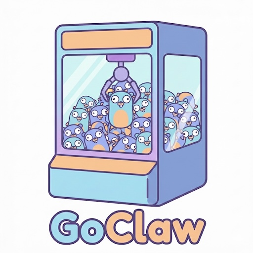

# Felix

A self-hosted AI agent gateway written in Go. Single binary, low memory, fast startup.

Felix connects you (via CLI or web chat) to LLMs (Claude, GPT, Gemini, DeepSeek, Ollama), enabling autonomous task execution on your own hardware. Inspired by [OpenClaw](https://github.com/openclaw/openclaw), rewritten in Go for single-binary deployment, sub-50MB memory, and <100ms startup.

---

## Features

- **Single binary** — no runtime dependencies, no Node.js, no npm. Download and run.
- **System tray app** — runs the gateway in the background with a tray icon, web chat, and one-click access to settings (macOS and Windows)
- **Two interfaces** — local CLI (`felix chat`) and a web chat page served by the gateway
- **Model-agnostic** — Claude, GPT, Gemini, DeepSeek, Ollama, LM Studio, or any OpenAI-compatible API
- **Multi-agent** — run multiple agents with different models, tools, and personas
- **Extended reasoning** — `reasoning: off|low|medium|high` per-agent knob unlocks Claude thinking budgets, OpenAI o-series `reasoning_effort`, and Gemini 2.5 thinking config; unsupported models are detected and the request runs without reasoning rather than failing
- **Cross-provider tool portability** — JSON Schema fields one provider rejects (Gemini drops `anyOf`/`oneOf`/`format`; OpenAI drops `$ref`/`definitions`) are stripped at the provider boundary with diagnostic logging, so a single tool definition works across providers
- **MCP client** — connect to external [Model Context Protocol](https://modelcontextprotocol.io) servers over Streamable-HTTP or stdio; remote tools auto-register into agent registries with OAuth2 client-credentials or bearer auth
- **Persistent memory** — BM25 lexical search over Markdown files, recalled automatically each turn; optional vector search via `chromem-go` when an embedding provider is configured
- **Cortex knowledge graph** — optional SQLite-backed knowledge graph (enabled by default) that ingests completed conversations and surfaces relevant facts on subsequent turns
- **Skill system** — Markdown files with YAML frontmatter, selectively injected per-turn based on relevance. Ships with bundled starter skills (`ffmpeg`, `imagemagick`, `pandoc`, `pdftotext`, `cortex`) seeded on first run; the skill name+description index is always injected so the agent knows what's available even when no skill matches closely
- **Cron jobs** — recurring prompts on configurable intervals, with pause/resume/remove management
- **Vision/image support** — paste or drop image paths in CLI/web chat and the LLM analyzes them
- **Tool policies** — per-agent allow/deny lists for all built-in tools
- **Session persistence** — append-only JSONL files with DAG structure and branching
- **Smart compaction** — token-threshold-triggered summarization with a 9-section structured prompt; three-stage fallback chain (full → small-only → placeholder) and per-session circuit breaker so a runaway summarizer can't block conversation
- **Cache-stability invariant** — request prefixes are byte-stable across turns (sorted tool definitions, deterministic schema normalization, "Resume directly" continuation directive after compaction) so Anthropic and OpenAI prompt caches keep hitting
- **Stream-failure resilience** — when a streaming response dies mid-flight (TCP reset, idle timeout, partial SSE) the runtime discards the partial output and retries the same request via the provider's non-streaming endpoint, preserving the byte-identical prompt prefix so the cache stays warm. Pre-flight failures (malformed request, 4xx) surface as before
- **Config hot-reload** — edit felix.json5 while running, changes apply immediately
- **WebSocket API** — JSON-RPC 2.0 control plane for programmatic access
- **Local-first** — all data lives on your filesystem, no external database

## Why Go?

| | OpenClaw (Node.js) | Felix (Go) |
|---|---|---|
| **Deployment** | Node.js 22+, npm, dependency install | Single static binary |
| **Memory** | ~150-400MB | ~20-50MB |
| **Startup** | 2-5 seconds | <100ms |
| **Cross-compile** | Per-platform npm rebuilds | `GOOS=linux GOARCH=arm64 go build` |
| **Concurrency** | Event loop + worker threads | Native goroutines |

---

## Quick Start

### Build

```bash
make build              # Build the CLI binary
make build-app          # Build the macOS menu bar app (Felix.app)
make build-app-windows  # Build the Windows system tray app (felix-app.exe)
```

### Setup

```bash
./felix onboard
```

The wizard walks you through choosing an LLM provider and entering your API key.

### Chat

```bash
# Interactive CLI session (no gateway needed)
./felix chat

# Start the full gateway (web chat, settings UI, WebSocket API)
./felix start

# Or launch the system tray app
open Felix.app              # macOS
felix-app.exe               # Windows
```

### Verify

```bash
./felix doctor
```

### Bundled local LLM (no API key needed)

Felix ships with a bundled Ollama binary so you can run agents offline with
no API key. On first run Felix pulls `gemma4:latest` (the chat model) and
`nomic-embed-text` (for memory embeddings) into the bundled Ollama instance
in the background.

To pull additional models later:

```bash
felix model pull qwen2.5:0.5b
felix model list
felix model status
felix model rm qwen2.5:0.5b
```

The bundled Ollama runs as a child of Felix on `127.0.0.1:18790` (next
free port in `:18790–:18799`) and shuts down when Felix exits. It does
not interfere with any system Ollama you may have on `:11434`.

---

## CLI Commands

| Command | Description |
|---------|-------------|
| `felix onboard` | Interactive setup wizard |
| `felix start` | Start the gateway server |
| `felix start -c path/to/config.json5` | Start with a custom config |
| `felix chat` | Interactive CLI chat with the default agent |
| `felix chat myagent` | Chat with a specific agent |
| `felix chat -m openai/gpt-5.4` | Chat with a model override |
| `felix clear [agent]` | Clear the local CLI session history for an agent |
| `felix sessions [agent]` | List all sessions for an agent |
| `felix model list \| pull <name> \| rm <name> \| status` | Manage local Ollama models pulled by Felix |
| `felix status` | Query the running gateway for agent status |
| `felix doctor` | Run diagnostic checks |
| `felix version` | Print version and commit info |

---

## System Tray App

Felix ships a system tray app that runs the gateway as a background service. Supported on macOS and Windows.

### Build

```bash
make build-app          # macOS — produces Felix.app
make build-app-windows  # Windows — produces felix-app.exe
```

### Launch

- **macOS:** Double-click `Felix.app` or drag it to `/Applications`
- **Windows:** Double-click `felix-app.exe`

### Menu items

| Item | Action |
|------|--------|
| **Chat** | Opens a web-based chat interface in your default browser |
| **Jobs** | Opens the cron jobs dashboard (`/jobs`) showing active scheduled tasks |
| **Settings** | Opens the web Settings UI (`/settings`) in your default browser — tabs: Agents, Providers, Models, Intelligence, Security, Messaging, MCP, Gateway |
| **Restart** | Restarts the gateway |
| **Quit** | Gracefully shuts down the gateway and exits |

### Web chat interface

The app serves a chat page at `http://localhost:18789/chat` (also accessible at `http://localhost:18789`). Features:

- Agent selector dropdown — switch between configured agents without leaving the page
- Streaming responses via WebSocket
- Light/dark mode toggle (persisted in browser)
- Inline tool call display with collapsible output
- Markdown rendering (headings, code blocks, tables, lists, horizontal rules, bold, italic, links)

### Environment variables

**macOS:** `.app` bundles don't inherit shell environment variables. Felix.app automatically loads your shell profile (`~/.zshrc`, `~/.bashrc`) at startup, so API keys set via `export ANTHROPIC_API_KEY=...` work as expected.

**Windows:** Set environment variables via System Settings or PowerShell:

```powershell
[System.Environment]::SetEnvironmentVariable("ANTHROPIC_API_KEY", "sk-ant-...", "User")
```

On both platforms, you can set API keys directly in the config file instead of using environment variables.

---

## Architecture

Single-process, hub-and-spoke design. All components run in one binary.

### Core Components

- **Gateway Server** (`cmd/felix/`) — HTTP + WebSocket server on `:18789` using chi router + gorilla/websocket. Entry point for all CLI subcommands via cobra.
- **CLI Adapter** — `felix chat` runs the agent loop directly against stdin/stdout with readline editing and Markdown rendering. The gateway also serves a web chat page at `/chat`.
- **Agent Runtime** — The think-act loop: assemble context (identity + skills + memory + history), stream LLM response, execute tool calls with policy checks, loop until final text response.
- **LLM Client** — Abstracted behind `LLMProvider` interface with `ChatStream()`, `Models()`, and `NormalizeToolSchema()` methods. Providers: Anthropic (`anthropic-sdk-go`), OpenAI (`sashabaranov/go-openai`), Google Gemini (`google.golang.org/genai`), Qwen (DashScope via go-openai), Ollama and other OpenAI-compatible endpoints. Each provider declares the JSON Schema dialect it accepts so cross-provider tool portability is enforced at the boundary; reasoning/thinking knobs are mapped per-provider from the unified `ReasoningMode` enum.
- **Session Manager** — Append-only JSONL files with DAG structure. One file per session. Supports compaction when history exceeds context window.
- **Message Router** — Declarative bindings (JSON) map channel + account + peer to agent IDs (currently only the `cli` channel routes through here). Priority: peer.id > peer.kind > accountId > channel > default.
- **Memory Manager** — BM25 lexical search over Markdown files in `~/.felix/memory/`. When an embedding provider is configured (`memory.embeddingProvider` + `memory.embeddingModel`), `chromem-go` builds an in-process vector index alongside BM25; lookups fall back to BM25 if the index fails to initialize.
- **Cortex** — optional knowledge graph (SQLite via the `sausheong/cortex` library, enabled by default). Completed conversation threads are ingested asynchronously; on subsequent turns, sufficiently long user prompts trigger a recall step that injects relevant facts into the system prompt.
- **Skill System** — Markdown files with YAML frontmatter, selectively injected per-turn based on relevance. Compatible with OpenClaw/Claude Code/Cursor skill format. Bundled starter skills are seeded into `~/.felix/skills/` on first run; additional skills can be uploaded, viewed, and deleted from the Settings page (Skills tab) and become active without restarting the process.
- **MCP Manager** — Connects to external Model Context Protocol servers declared in `mcp_servers`. Supports Streamable-HTTP (with OAuth2 client-credentials or bearer auth) and stdio transports. Tools exposed by remote servers are wrapped as `tools.Tool` adapters and registered into agent registries; tool names are auto-added to agent allowlists.
- **Cron Scheduler** — Recurring prompts on configurable intervals (e.g., "24h", "1h", "30m"). Supports pause, resume, remove, and schedule updates at runtime.
- **Config Manager** — JSON5 config at `~/.felix/felix.json5`, hot-reloaded via fsnotify.

### Key Interfaces

```go
// Channel — messaging platform adapter
type Channel interface {
    Name() string
    Connect(ctx context.Context) error
    Disconnect() error
    Send(ctx context.Context, msg OutboundMessage) error
    Receive() <-chan InboundMessage
    Status() ChannelStatus
}

// LLMProvider — model provider
type LLMProvider interface {
    ChatStream(ctx context.Context, req ChatRequest) (<-chan ChatEvent, error)
    Models() []ModelInfo
    // NormalizeToolSchema strips JSON Schema fields the provider rejects
    // and returns one Diagnostic per stripped/rewritten/rejected field.
    // Must be deterministic — required for prompt cache stability.
    NormalizeToolSchema(tools []ToolDef) ([]ToolDef, []Diagnostic)
}

// Tool — executable tool
type Tool interface {
    Name() string
    Description() string
    Parameters() json.RawMessage
    Execute(ctx context.Context, input json.RawMessage) (ToolResult, error)
}
```

---

## Interfaces

### CLI

Interactive terminal chat with Markdown rendering. Available via `felix chat` without starting the full gateway. Supports image input — paste or drag-and-drop a file path to send images to the LLM for vision analysis.

### Web chat

Served by the gateway at `http://127.0.0.1:18789/chat` once `felix start` is running (or via the system tray app). Streaming responses, agent switcher, light/dark mode, inline tool-call display, and Markdown rendering.

---

## Configuration

All configuration lives in `~/.felix/felix.json5` (JSON5 format for comments and trailing commas).

### LLM Providers

Felix supports six provider kinds. Each provider is defined in the `providers` section of the config with a unique name, a `kind`, and connection details.

| Kind | Description | Requires |
|------|-------------|----------|
| `anthropic` | Anthropic's Claude API | `api_key` |
| `openai` | OpenAI's API (GPT models) | `api_key` |
| `gemini` | Google's Gemini API | `api_key` |
| `qwen` | Alibaba Cloud's Qwen (Tongyi Qianwen) API | `api_key` |
| `openai-compatible` | Any OpenAI-compatible API (Ollama, LM Studio, DeepSeek, LiteLLM, etc.) | `base_url`, optionally `api_key` |
| `local` | Bundled local LLM runtime (Ollama supervised by Felix) — wired up automatically by the onboarding wizard | none |

**Standard providers (Anthropic, OpenAI):**

```json5
{
  "providers": {
    "anthropic": {
      "kind": "anthropic",
      "api_key": "sk-ant-api03-..."
    },
    "openai": {
      "kind": "openai",
      "api_key": "sk-proj-..."
    },
    "gemini": {
      "kind": "gemini",
      "api_key": "AIza..."
    },
    "qwen": {
      "kind": "qwen",
      "api_key": "sk-..."  // DashScope API key
    }
  }
}
```

**Custom / OpenAI-compatible providers:**

Any service exposing an OpenAI-compatible API (e.g., `/v1/chat/completions`) works with kind `openai-compatible`. Set the `base_url` to the API root.

```json5
{
  "providers": {
    // Ollama — local models, no API key needed
    "ollama": {
      "kind": "openai-compatible",
      "base_url": "http://localhost:11434/v1"
    },

    // LM Studio — local models
    "lmstudio": {
      "kind": "openai-compatible",
      "base_url": "http://localhost:1234/v1"
    },

    // DeepSeek — cloud API with OpenAI-compatible endpoint
    "deepseek": {
      "kind": "openai-compatible",
      "api_key": "sk-...",
      "base_url": "https://api.deepseek.com/v1"
    },

    // LiteLLM — proxy for multiple providers
    "litellm": {
      "kind": "openai-compatible",
      "base_url": "http://localhost:4000/v1"
    }
  }
}
```

### Model references

Agents reference models as `provider/model-name`, where the provider name matches a key in the `providers` section:

```json5
"model": "anthropic/claude-sonnet-4-5-20250514"   // Anthropic Claude
"model": "openai/gpt-5.4"                         // OpenAI GPT-5.4
"model": "openai/gpt-5.4-mini"                    // OpenAI GPT-5.4 Mini (cheaper)
"model": "ollama/llama3"                          // Ollama local model
"model": "deepseek/deepseek-chat"                  // DeepSeek
"model": "gemini/gemini-2.5-flash"                 // Google Gemini
"model": "lmstudio/qwen2.5-coder-14b"             // LM Studio local model
"model": "qwen/qwen-plus"                          // Qwen Plus (Alibaba Cloud)
"model": "qwen/qwen-max"                           // Qwen Max (most capable)
```

### API keys via environment variables

API keys can be set via environment variables instead of the config file. Environment variables take precedence.

```bash
export ANTHROPIC_API_KEY="sk-ant-api03-..."
export OPENAI_API_KEY="sk-proj-..."
export DEEPSEEK_API_KEY="sk-..."
export GEMINI_API_KEY="AIza..."
export QWEN_API_KEY="sk-..."  // DashScope API key
```

The naming convention is `{PROVIDER}_API_KEY` (or `{PROVIDER}_AUTH_TOKEN`), and `{PROVIDER}_BASE_URL` for custom endpoints — where `{PROVIDER}` is the uppercased provider name from your config.

### MCP servers

Felix can connect to external [Model Context Protocol](https://modelcontextprotocol.io) servers and expose their tools to agents alongside built-ins. Declare servers under `mcp_servers`:

```json5
{
  "mcp_servers": [
    // HTTP transport with OAuth2 client-credentials.
    // client_secret can live inline ("client_secret"), in an env var
    // ("client_secret_env"), or in a separate dotenv-style creds file.
    {
      "id": "remote-tools",
      "transport": "http",
      "enabled": true,
      "tool_prefix": "remote_",
      "http": {
        "url": "https://mcp.example.com/v1",
        "auth": {
          "kind": "oauth2_client_credentials",
          "token_url": "https://auth.example.com/oauth/token",
          "client_id": "felix-prod",
          "client_secret_env": "REMOTE_MCP_SECRET",
          "scope": "mcp.read mcp.write"
        }
      }
    },

    // HTTP transport with a static bearer token.
    {
      "id": "internal-api",
      "transport": "http",
      "enabled": true,
      "http": {
        "url": "https://internal.example.com/mcp",
        "auth": { "kind": "bearer", "token_env": "INTERNAL_MCP_TOKEN" }
      }
    },

    // Stdio transport — Felix spawns the child process and inherits PATH.
    {
      "id": "fs-tools",
      "transport": "stdio",
      "enabled": true,
      "stdio": {
        "command": "uvx",
        "args": ["mcp-server-filesystem", "/Users/me/projects"],
        "env": { "DEBUG": "1" }
      }
    }
  ]
}
```

Tools discovered from an MCP server are auto-added to agent allowlists at startup; remove individual entries from an agent's `tools.allow` if you want to scope access. Servers can also be edited from the Settings UI's MCP tab.

### Full config example

```json5
{
  "providers": {
    "anthropic": { "kind": "anthropic", "api_key": "sk-ant-..." },
    "openai":    { "kind": "openai",    "api_key": "sk-..." },
    "ollama":    { "kind": "openai-compatible", "base_url": "http://localhost:11434/v1" }
  },
  "agents": {
    "list": [
      {
        "id": "default",
        "name": "Felix",
        "model": "anthropic/claude-sonnet-4-5-20250514",
        "reasoning": "high",  // off | low | medium | high; default off
        "workspace": "~/.felix/workspace-default",
        "system_prompt": "You are a helpful coding assistant.",  // optional: overrides IDENTITY.md
        "tools": {
          "allow": ["read_file", "write_file", "edit_file", "bash", "web_fetch", "web_search", "browser", "cron", "send_message"]
        }
      }
    ]
  },
  "bindings": [
    { "agentId": "default", "match": { "channel": "cli" } }
  ],
  "channels": {
    "cli": { "enabled": true }
  },
  "mcp_servers": [
    {
      "id": "remote-tools",
      "transport": "http",
      "enabled": true,
      "http": {
        "url": "https://mcp.example.com/v1",
        "auth": { "kind": "bearer", "token_env": "REMOTE_MCP_TOKEN" }
      }
    }
  ],
  "memory": { "enabled": true },
  "cortex": { "enabled": true },
  "security": {
    "execApprovals": { "level": "full" }
  }
}
```

---

## Tools

Built-in tools that agents can use:

| Tool | Description |
|------|-------------|
| `read_file` | Read file contents |
| `write_file` | Create or overwrite files |
| `edit_file` | Make targeted edits to existing files |
| `bash` | Execute shell commands (uses `bash` on macOS/Linux, `cmd.exe` on Windows) |
| `web_fetch` | Fetch a URL and return its content |
| `web_search` | Search the web |
| `browser` | Headless Chrome automation (navigate, click, type, screenshot, evaluate JS). All actions accept an optional `url` to navigate before acting |
| `cron` | Dynamically schedule, list, pause, resume, remove, and update recurring tasks |
| `send_message` | Send outbound messages over a configured channel (currently Telegram via Bot API) |
| `todo_write` | Per-workspace persistent todo list. Used by the agent to externalise plans for any task with 3+ distinct steps; state is reloaded from disk before every operation so concurrent edits are picked up |
| `task` | Delegate a subtask to another configured agent. The supervisor agent picks up the result; the subagent runs with its own model + tool policy + isolated session |
| `load_skill` | Load a single skill body on demand by name. The Skills Index in the system prompt lists every available skill; the body is fetched only when the agent decides it needs it (saves the per-turn injection cost) |
| `load_memory` | Same pattern for memory entries — load a single entry body by id when the Memory Index says it's relevant |

Tool access is controlled per-agent via allow/deny policies, configurable from the Settings UI's Agents tab.

**MCP-provided tools** — any [Model Context Protocol](https://modelcontextprotocol.io) server declared in `mcp_servers` exposes its tools through the same `Tool` interface. They appear in agent registries alongside built-ins, can be allow/deny-listed per agent, and (when newly discovered) are auto-added to agent allowlists at startup.

---

## Data Directory

All state lives in `~/.felix/` (on Windows: `C:\Users\<you>\.felix\`) — no external database required.

```
~/.felix/
  felix.json5             # Configuration file
  sessions/                # Conversation history (JSONL)
  memory/entries/          # Memory entries (Markdown)
  skills/                  # Shared skills (SKILL.md files); bundled
                           # starter skills (ffmpeg, imagemagick, pandoc,
                           # pdftotext, cortex) are seeded here on first run
  workspace-default/       # Default agent workspace
    IDENTITY.md            # Agent identity/persona (fallback if no system_prompt in config)
    skills/                # Agent-specific skills
  brain.db                 # Cortex knowledge graph (SQLite)
  ollama/                  # Bundled Ollama model store
```

Everything is human-readable files you can inspect, edit, and version-control.

---

## WebSocket API

JSON-RPC 2.0 over WebSocket at `ws://127.0.0.1:18789/ws`.

| Method | Description |
|--------|-------------|
| `chat.send` | Send a message to an agent (streams response events) |
| `chat.abort` | Cancel the active response for this connection |
| `chat.compact` | Force-compact the active session immediately |
| `agent.status` | List all configured agents and their state |
| `session.list` | List sessions for an agent |
| `session.new` | Start a fresh session for an agent |
| `session.switch` | Switch the active session for an agent |
| `session.history` | Load conversation history for an agent |
| `session.clear` | Clear an agent's session history |

HTTP endpoints: `GET /health` (health check), `GET /ws` (WebSocket), `GET /metrics` (Prometheus metrics, when enabled), `GET /ui` (control panel, when enabled), `GET /chat` (web chat interface), `GET /jobs` (cron jobs dashboard), `GET /settings` (settings UI — Agents, Providers, Models, Intelligence, Security, Messaging, MCP, Gateway tabs).

---

## Security

Felix is designed to run on your own hardware. The following measures protect your system, credentials, and data.

### Network & Transport

- **Localhost-only by default** — the gateway binds to `127.0.0.1:18789`, never exposed to the network unless you change the config
- **Bearer token auth** — optional token protects all HTTP and WebSocket endpoints; uses constant-time comparison to prevent timing attacks
- **WebSocket origin checking** — only connections from localhost origins are accepted by default; configurable allowlist for custom origins
- **ReadHeaderTimeout** — 5-second header timeout defends against slowloris attacks
- **Security headers** — the web chat page sets `X-Frame-Options: DENY`, `Content-Security-Policy`, and `X-Content-Type-Options: nosniff` to prevent clickjacking and XSS

### Tool Execution

- **Tool policies** — per-agent allow/deny lists control which tools each agent can use
- **Exec approval policy** — three levels for the bash tool:
  - `deny` — all shell execution blocked
  - `allowlist` — only commands in the allowlist can run; shell metacharacters (`$(...)`, backticks, process substitution) are blocked to prevent bypasses
  - `full` — unrestricted (default)
- **Workspace containment** — file tools (`read_file`, `write_file`, `edit_file`) validate paths against the agent's workspace directory with symlink resolution to prevent path traversal

### Input Validation

- **SSRF protection** — `web_fetch` and `browser` tools resolve hostnames and block private IP ranges (RFC 1918, loopback, link-local, IPv6 ULA) and cloud metadata endpoints. DNS resolution failures are blocked (fail-closed). Redirect targets are re-validated at each hop to prevent redirect-based SSRF bypasses
- **XSS prevention** — the web chat UI escapes HTML before applying markdown formatting, and blocks `javascript:`, `data:`, and `vbscript:` URL schemes in rendered links
- **WebSocket rate limiting** — per-connection token bucket (30 messages/sec) prevents message flooding
- **WebSocket message size limit** — 1MB max message size prevents memory exhaustion from oversized payloads

### Credentials & Data

- **No hardcoded secrets** — all API keys and tokens come from config or environment variables
- **Config file permissions** — the `onboard` command writes config with `0o600` (owner-only) to protect API keys and bot tokens. At startup, a warning is logged if the config file is readable by group or others
- **Session file permissions** — conversation history files use `0o600` (owner-only)
- **DEBUG-level tool logging** — tool inputs and outputs (which may contain sensitive data) are logged at DEBUG, not INFO, so they don't appear in production logs
- **API keys via environment** — credentials can be set as `{PROVIDER}_API_KEY` environment variables to keep them out of config files entirely

---

## Development

```bash
make build                  # Build the CLI binary
make build-app              # Build the macOS menu bar app (Felix.app)
make build-app-windows      # Build the Windows system tray app (felix-app.exe)
make test                   # Run all tests
make test-race              # Run tests with race detector
make lint                   # Run golangci-lint
make fmt                    # Format source files
make tidy                   # Tidy module dependencies
make release TAG=v0.3.1     # Commit, push, create GitHub release, and build cross-platform binaries (TAG required)
make publish-release        # Publish a GH release for the latest tag with notes from the previous tag, attaching dist/*.zip and dist/*.pkg
make build-release          # Cross-compile binaries without creating a GitHub release
make sign                   # Build the macOS PKG installer, sign, notarize, and staple (output → dist/Felix-<VERSION>-signed.pkg)
make snapshot               # Cross-platform build via goreleaser
make help                   # Show all targets
```

### Dependencies

| Purpose | Package |
|---------|---------|
| HTTP router | `github.com/go-chi/chi/v5` |
| WebSocket | `github.com/gorilla/websocket` |
| CLI framework | `github.com/spf13/cobra` |
| Anthropic client | `github.com/anthropics/anthropic-sdk-go` |
| OpenAI client | `github.com/sashabaranov/go-openai` |
| Gemini client | `google.golang.org/genai` |
| MCP client SDK | `github.com/modelcontextprotocol/go-sdk` |
| Knowledge graph | `github.com/sausheong/cortex` |
| Vector index | `github.com/philippgille/chromem-go` |
| HTML → Markdown | `github.com/JohannesKaufmann/html-to-markdown/v2` |
| Markdown rendering (CLI) | `github.com/charmbracelet/glamour` |
| File watching | `github.com/fsnotify/fsnotify` |
| Browser automation | `github.com/chromedp/chromedp` |
| OAuth2 (MCP auth) | `golang.org/x/oauth2` |
| System tray | `fyne.io/systray` |
| YAML (skill frontmatter) | `gopkg.in/yaml.v3` |
| Testing | `github.com/stretchr/testify` |
| Logging | `log/slog` (stdlib) |

### Testing

```bash
go test ./...              # Run all tests
go test -cover ./...       # Run tests with per-package coverage
go test -race ./...        # Run tests with race detector
```

Per-package test coverage:

| Package | Coverage |
|---------|----------|
| `internal/tokens` | 90.2% |
| `internal/heartbeat` | 88.6% |
| `internal/skill` | 87.8% |
| `internal/compaction` | 82.7% |
| `internal/agent` | 79.5% |
| `internal/local` | 77.9% |
| `internal/config` | 76.8% |
| `internal/memory` | 76.4% |
| `internal/channel` | 76.3% |
| `internal/mcp` | 73.5% |
| `internal/llm/llmtest` | 68.4% |
| `internal/router` | 63.6% |
| `internal/session` | 61.2% |
| `internal/tools` | 55.8% |
| `internal/llm` | 53.4% |
| `internal/startup` | 37.3% |
| `internal/cron` | 34.4% |
| `internal/cortex` | 20.7% |
| `internal/gateway` | 15.6% |
| `cmd/felix` | 4.9% |

---

## Feature Comparison with OpenClaw

| Feature | OpenClaw | Felix |
|---------|----------|--------|
| Gateway (WebSocket control plane) | Yes | Yes |
| CLI / Terminal channel | Yes | Yes |
| Web chat UI | No | Yes |
| Telegram / WhatsApp / other messaging channels | Yes (15+) | Outbound Telegram only (`send_message` tool); no inbound channel adapters |
| Agent loop with tool calling | Yes (via Pi SDK) | Yes (native Go) |
| Session persistence (JSONL DAG) | Yes | Yes |
| Multi-agent routing | Yes | Yes |
| Skill system (Markdown format) | Yes | Yes (format-compatible) |
| Persistent memory | Yes | Yes |
| Knowledge graph (Cortex) | No | Yes |
| MCP client (external tool servers) | Yes | Yes |
| Cron scheduling | Yes | Yes |
| Config hot-reload | Yes | Yes |
| Tool policies | Yes | Yes |
| Browser automation (CDP) | Yes | Yes |
| Web chat & Settings UI | Yes | Yes |
| Bundled local LLM (no API key) | No | Yes (Ollama supervisor) |
| Canvas / A2UI | Yes | No |
| Voice (TTS/STT) | Yes | No |
| Sandboxing (Docker / namespaces) | Yes | Config field only — not yet implemented |
| Inter-agent delegation | Yes | No |
| Plugin system | Yes (TypeScript) | No |
| **Single-binary deployment** | No (Node.js required) | **Yes** |
| **Sub-50MB memory** | No (~150-400MB) | **Yes** |
| **<100ms cold start** | No (2-5s) | **Yes** |

---

## Documentation

- [How to Use Felix](howtouse.md) — detailed examples, use cases, and example configurations
